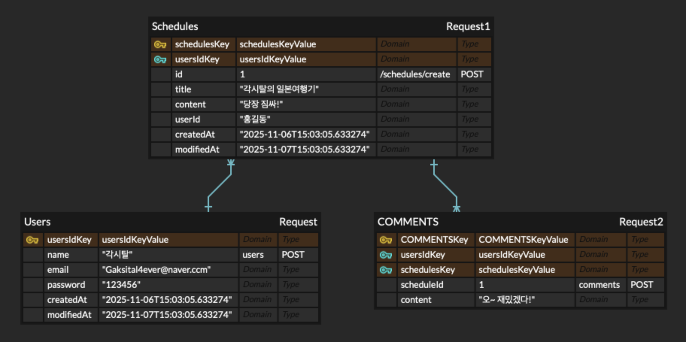

---

# 📌 README.md

````md
# 📅 Schedule App Develop

Spring Boot · JPA · MySQL 기반 일정 & 유저 관리 서비스입니다.  
회원가입 → 로그인(Session) → 일정 CRUD → 댓글 CRUD 흐름으로 동작합니다.

---

## 🛠 Tech Stack
- Java 17  
- Spring Boot 3.5.7  
- Spring Web / Spring Data JPA  
- MySQL 8.4.7  
- Lombok  
- Validation  
- Cookie / Session  
  BCrypt 패스워드 암호화

---

## 📐 ERD  
User (1) — (N) Schedule
Schedule (1) — (N) Comment  
User (1) — (N) Comment

**User**
- id, name, email, password  
- createdAt, modifiedAt  

**Schedule**
- id, toDoTitle, toDoContent  
- userId(FK)  
- createdAt, modifiedAt  

**Comment**
- id
- commentContent
- scheduleId(FK)
- userId(FK)
- createdAt, modifiedAt
````

---
# 🗺️ ERD


# 📌 API
[API_SCHEDULE.md](src/main/java/com/scheduleappdevelop2/docs/apiSpecification/API_SCHEDULE.md)  
[API_USER.md](src/main/java/com/scheduleappdevelop2/docs/apiSpecification/API_USER.md)  
[API_COMMENT.md](src/main/java/com/scheduleappdevelop2/docs/apiSpecification/API_COMMENT.md)

## 🧑‍💻 User API

### ▶ 회원가입
```
POST /users
```
```json
{ "name": "홍길동", "email": "test@test.com", "password": "1234" }
```

### ▶ 로그인 (세션 생성 — loginUser 저장)
```
POST /users/login
```
```json
{ "email": "test@test.com", "password": "123456" }
```

### ▶ 유저 조회
```
GET /users
GET /users/{id}
```

### ▶ 유저 수정
```
PATCH /users/{id}
```

### ▶ 유저 삭제
```
DELETE /users/{id}
```

---

# 📂 Schedule API

### ▶ 일정 생성
```
POST /schedules
```
```json
{
  "title": "제목",
  "content": "내용"
}
```

### ▶ 전체 조회
```
GET /schedules
```

### ▶ 단건 조회
```
GET /schedules/{id}
```

### ▶ 일정 수정
```
PATCH /schedules/{id}
```
```json
{ "title": "새 제목", "content": "새 내용" }
```

### ▶ 일정 삭제
```
DELETE /schedules/{id}
```

---

# 💬 Comment API

### ▶ 댓글 생성
```
POST /comments
```
```json
{
  "scheduleId": 1,
  "commentContent": "댓글 내용입니다."
}
```

### ▶ 댓글 전체 조회 (특정 일정)
```
GET /comments/schedule/{scheduleId}
```

### ▶ 댓글 단건 조회
```
GET /comments/{id}
```

### ▶ 댓글 수정
```
PATCH /comments/{id}
```
```json
{
  "commentContent": "수정된 댓글 내용"
}
```

### ▶ 댓글 삭제
```
DELETE /comments/{id}
```

---

# ⚠ Error Handling

- 글로벌 예외 핸들러(GlobalExceptionHandler)
- Custom Exceptions
    - `CustomException`
  - ErrorMessage
  - 
---

## 📁 Project Structure

```
src/main/java/com.scheduleappdevelop2
 ├── schedule
 │     ├── controller
 │     ├── service
 │     ├── repository
 │     ├── dto
 │     │    ├── request
 │     │    └── response
 │     └── entity
 │
 ├── user
 │     ├── controller
 │     ├── service
 │     ├── repository
 │     ├── dto
 │     │    ├── request
 │     │    └── response
 │     └── entity
 │
 ├── comment
 │     ├── controller
 │     ├── service
 │     ├── repository
 │     ├── dto
 │     │    ├── request
 │     │    └── response
 │     └── entity
 │
 └── global
       ├── config         (PasswordEncoder, JPAAuditing, WebConfig)
       ├── exception      (전역 예외핸들러 + 커스텀 예외 +  이넘)
       ├── baseTimeEntity (BaseTimeEntity)
       └── fillter        (AuthFillter)
```

---

## 🚀 실행 방법

### 1) DB 생성

```sql
CREATE DATABASE schedules;
```

### 2) application.properties
```properties
spring.datasource.url=jdbc:mysql://localhost:3306/schedules
spring.datasource.username=root
spring.datasource.password=12345678
spring.jpa.hibernate.ddl-auto=create
spring.jpa.open-in-view=false
```

### 3) 실행
```
./gradlew bootRun
````

---
